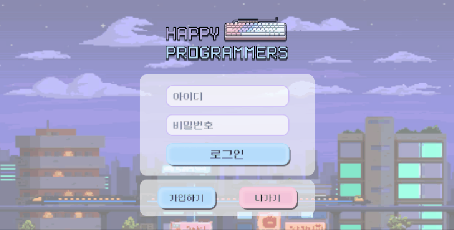
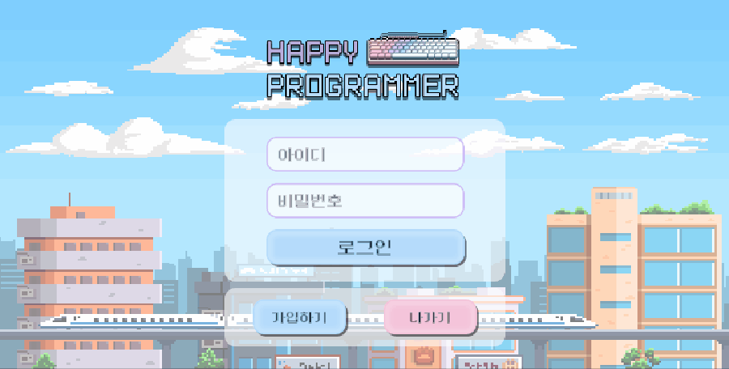
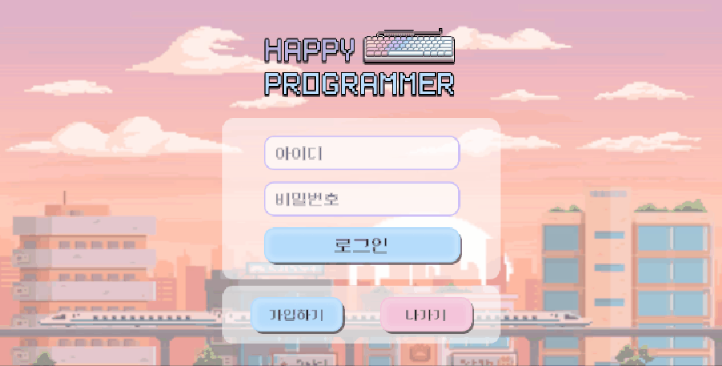
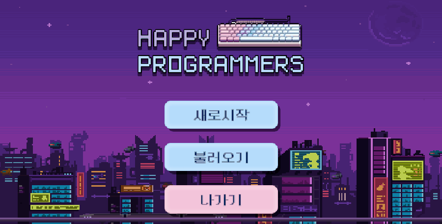
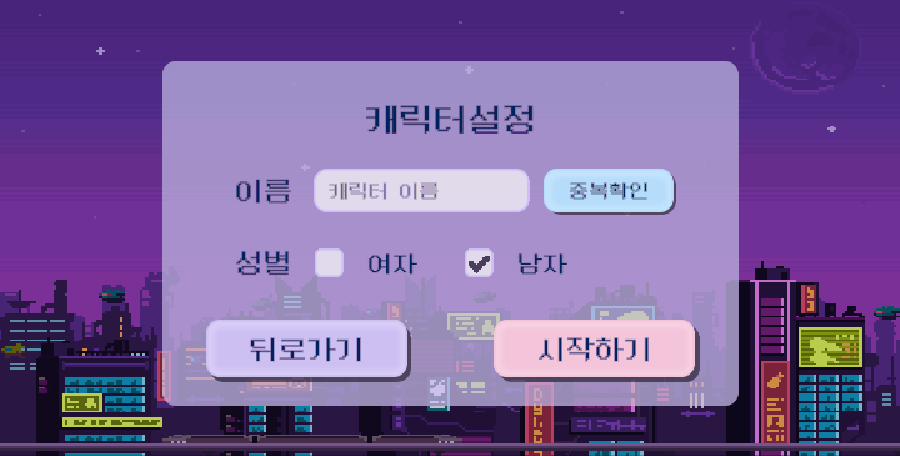
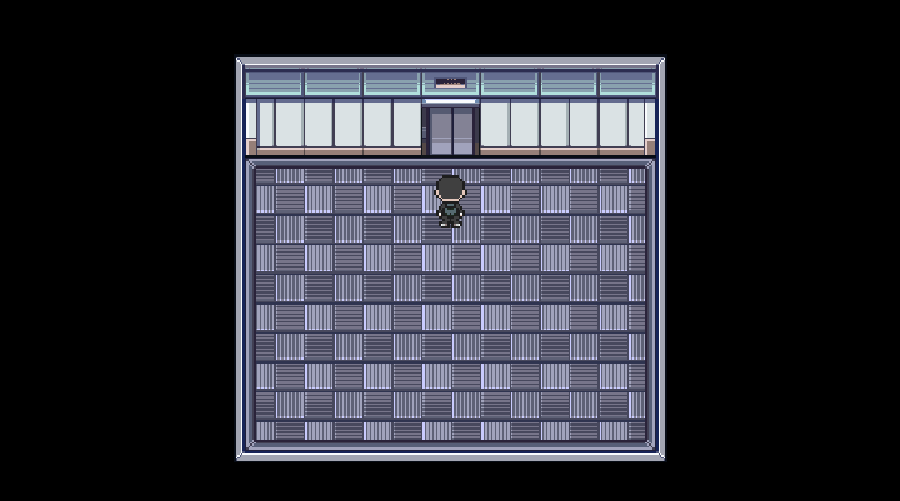
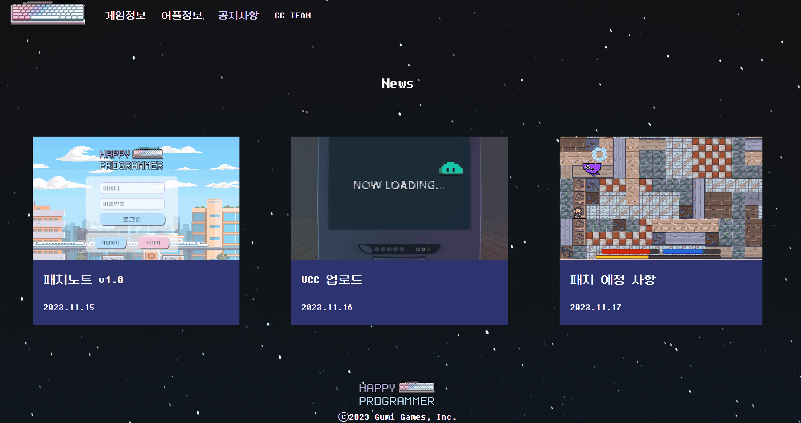

<h2>Happy Programmer🎮</h2>
교수님의 추천으로 세계 4대 기업 중 하나에
개발자로 입사하게 된 주인공!

두근거림을 안고 입사한 회사에는
사실 엄청난 비밀이?!

사원을 괴롭히는 괴물을 물리치고 퍼즐을 해결하며 비밀을 파헤치자.   ☆⌒(*＾-゜)v 🍀

## 목차

- [개요](#개요) 
- [게임 설명](#게임-설명)
- [게임 플레이 방식](#게임-플레이-방식)
- [실제 게임 플레이](#실제-게임-플레이)
- [게임 보조 어플](#게임-보조-어플)
- [게임 소개 및 다운로드 페이지](#게임-소개-및-다운로드-페이지)

## 개요

- 프로젝트 이름: Happy Programmer🎮
- 프로젝트 기간: 2023.10-2023.11
- 개발 엔진 및 언어: Unity & C# & Spring Boot & Java & Android Studio & Kotlin & React
- 멤버: 팀 Gumi Games(정진욱, 김수민, 김슬기, 손준배, 황하음, 차선호)

## 게임 설명

교수의 추천으로 IT 회사에 입사하게 된 주인공. 처음엔 회사 평도 좋고 퇴사자도 거의 없다는 소문에 행복하게 입사한다. 하지만 점점 회사의 내막을 알아가게 되고..

미니게임과 퀘스트를 통해 포인트를 모아 장비를 강화하여 스토리를 파헤쳐보자‼ 

## 게임 플레이 방식

| 이동방향 | 상(위) | 좌(왼쪽) | 하(아래) | 우(오른쪽) |
| ---- | ---- | ----- | ----- | ------ |
| 키보드  | W    | A     | S     | D      |
| 방향키  | ⬆️   | ⬅️     | ⬇️    | ➡️     |

| 단축키 | 일반공격 | 스킬  | 상호작용      | 인벤토리 | 게임저장 | 설정  |
| --- | ---- | --- | --------- | ---- | ---- | --- |
| 키보드 | Z    | X   | SPACE BAR | I    | F5   | ESC |

## 실제 게임 플레이

#### 게임 내에서 회원가입과 로그인이 가능!!🔑🔓

- 현실 시간대⏲ 에 맞게 로그인 화면이 바뀌어요!

 

#### 게임 시작 및 캐릭터 생성👨‍💼👩‍💼

- 캐릭터 생성은 필수 😎

#### 맵 이동 및 퀘스트🏆

- NPC에게 가까이 가면 말을 걸고 퀘스트를 받을 수 있어요

- 엘레베이터를 통해 맵 이동이 가능해요!

#### 미니게임 (버그 사냥)⚔

- 공격과 스킬을 이용해 버그를 사냥해봐요!
- 미니게임을 통해 레벨업을 하고 포인트를 모아봐요!

## 게임 보조 어플

#### 게임 계정 연동

#### 게임 내 아이템, 스킬, 몬스터 도감 제공

- 키워드 검색⌨ 기능 제공

- 즐겨찾기❤ 기능 제공

#### 게임 내 미션 연동 기능

- 물건을 📸사진으로 찍어야하는 미션을 위해 AI 사진 인식 기능을 통해 게임 내 미션 연동  

## 게임 소개 및 다운로드 페이지

#### 메인

- 메인 화면에서 게임 다운로드 가능

#### 게임 정보

- 게임의 스토리, 조작법 확인 가능

#### 어플 정보

- 어플 다운로드, 어플 기능 확인 가능

#### 공지사항

- 게시글 확인 가능

#### 팀원 소개

- 자율 프로젝트 기간동안 고생한 Gumi Games 팀원들 고생 많았어요❤

